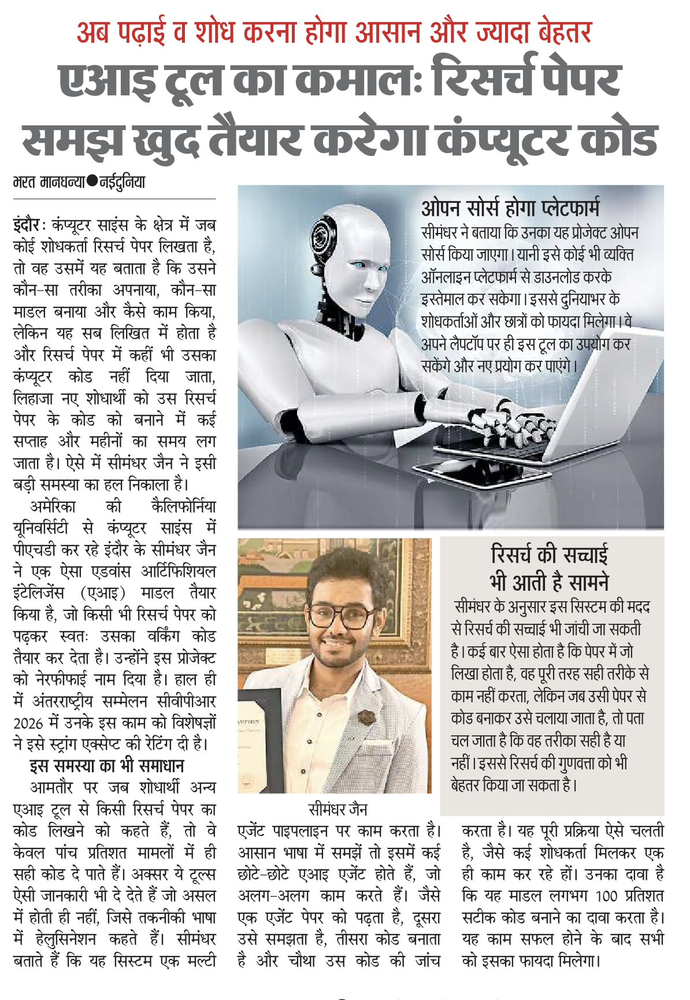
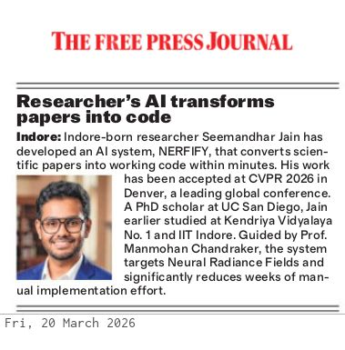
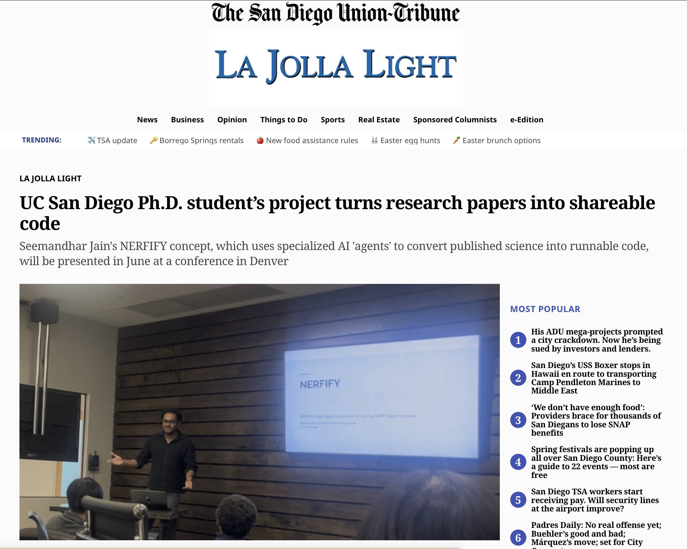
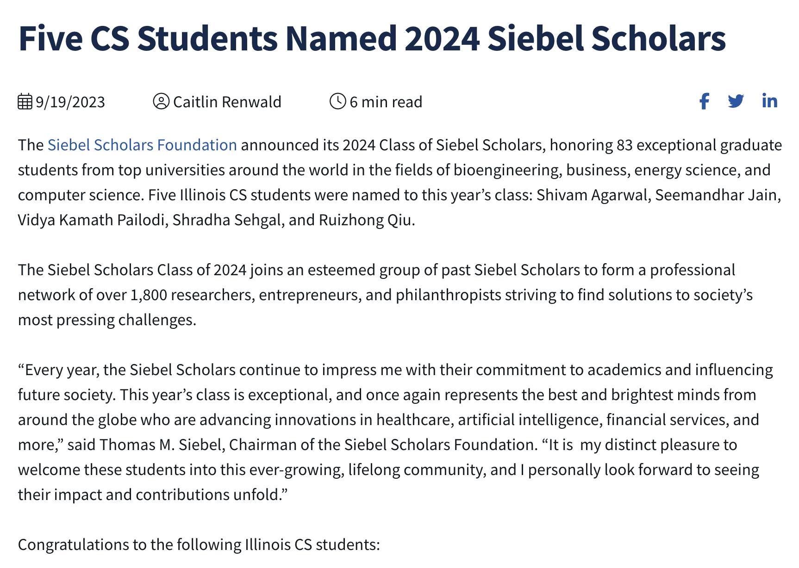

## About Me

I am Seemandhar Jain, a PhD student in Computer Science at the [University of California San Diego](https://cseweb.ucsd.edu/~mkchandraker/), advised by [Prof. Manmohan Chandraker](https://cseweb.ucsd.edu/~mkchandraker/). I work at the intersection of large language models (LLMs) and 3D vision, with a focus on multi-agent systems for 3D scene understanding, reconstruction, and generation; NeRFs; and diffusion models for 3D-aware image/video synthesis.

Previously, I completed my MS in Computer Science at the [University of Illinois Urbana–Champaign](https://cs.illinois.edu/) (GPA 3.92/4), advised by [Prof. David Forsyth](http://luthuli.cs.uiuc.edu/~daf/), where I worked on single-shot 3D reconstruction, convex decomposition, intrinsic image decomposition and relighting with diffusion models, and 2D-to-3D transformations. I am a [Siebel Scholar, Class of 2024](https://www.siebelscholars.com/).

I graduated with a B.Tech in Computer Science and Engineering from the [Indian Institute of Technology Indore](https://www.iiti.ac.in/). I founded [HealthAIgnite](http://healthaignite.com/), a healthcare AI consulting company focused on computer vision. I have also worked with industry research and product teams, including Google (Student Researcher, BigML), Aireal (Research Scientist, CV), DOCOMO Innovations (Research Intern), and Salesforce (AMTS, AI).

Quick links: [LinkedIn](https://linkedin.com/in/seemandharjain) · [GitHub](https://github.com/jainsee24) · [Website](http://seemandharjain.web.illinois.edu/) 
<!-- · [Talk](https://www.youtube.com/watch?v=VIDEO_ID) -->

<!-- ## Talk

A talk on my research is available here: [YouTube](https://youtu.be/lT77jFuQMzE).

	<iframe
		src="https://www.youtube.com/embed/lT77jFuQMzE"
		title="Research Talk"
		frameborder="0"
		allow="accelerometer; autoplay; clipboard-write; encrypted-media; gyroscope; picture-in-picture; web-share"
		allowfullscreen
		style="position: absolute; top: 0; left: 0; width: 100%; height: 100%;">
	</iframe>
  

 -->

## Research Interests

- 3D Vision and Graphics: NeRFs, single-shot 3D reconstruction, convex decomposition, 3D-aware image/video generation, relighting
- Generative Models: diffusion models for image/video and 3D synthesis; accelerating sampling and improving geometric consistency
- LLMs and Agents: multi-agent LLM frameworks for 3D scene understanding, reconstruction, and tool-augmented reasoning



## News

- **[Mar 2026]** Invited talk at Google on NERFIFY.
- **[Jan 2026]** Invited talk at Pixel Cafe.
- **[Jun 2025]** Student Researcher (BigML) at Google, New York; optimized SANA diffusion for Veo and built Gemma 2–based captioning.
- **[Jul 2024]** Started PhD in Computer Science at UC San Diego (advisor: Prof. Manmohan Chandraker).
- **[May 2024]** Joined Aireal as Research Scientist (Computer Vision) on single-image-to-3D textured mesh and AI interior design (Livvy).
- **[Sep 2023]** Selected as [Siebel Scholar, Class of 2024](https://cs.illinois.edu/news/Five/CS/Students/2024/Siebel/Scholars)
- **[Aug 16, 2023]** Started working as a Teaching Assistant for CS124: Intro to Computer Science (Fall 2023)
- **[May 15, 2023]** Joined the AI team in Docomo Innovations, Inc as a Research Intern!
- **[Jan 17, 2023]** Started working as a Teaching Assistant for CS128: Intro to Computer Science (Spring 2023)
- **[Aug 22, 2022]** Started working as a Teaching Assistant for CS225: Data Structures (Fall 2022)
- **[Aug 15, 2022]** Joined the MS CS program at University of Illinois, Urbana-Champaign!
- **[Sep 3, 2021]** Interviewed by [Times of India](https://timesofindia.indiatimes.com/city/nagpur/iit-indore-using-ai-to-develop-network-to-detect-fires-in-melghat-tiger-reserve/articleshow/85877519.cms) for research on wildfire detection algorithm.
- **[Jun 5, 2021]** Joined the BI team at Salesforce as a Software Developer.
- **[May 15, 2021]** Graduated with B.Tech degree in Computer Science from IIT Indore.
- **[May 2021]** Received the Best BTP award from Computer Science Department among the graduating students.
- **[Aug 2020]** Secured 8th rank in IEEE Programming League hosted by IEEE Computer Society on Codingblocks.
- **[Oct 2017]** Secured 3rd rank in Intra IIT Tech Meet Robo Race.
- **[July 2017]** Achieved All India Rank 1st in IIT JEE Advanced Mathematics Section with a score of 122/122 and overall rank of 1400 among a million students.
- **[May 2016]** Secured AIR 43 in Technothlon hosted by IIT GUWAHATI.
- **[Dec 2015]** Secured State rank 2 and International rank 26 in International Mathematics Olympiad.
- **[Aug 2013]** Became a UCMAS degree scholar, and secured 9th rank in UCMAS global competition.

## Media Coverage

<a href="https://epaper.naidunia.com/28-mar-2026-74-indore-edition-indore-page-17.html" target="_blank" class="media-card">

Mar 2026

Naidunia

AI Tool Ka Kamaal: Research Paper Samajh Khud Taiyar Karega Computer Code

</a>

<a href="https://epaper.freepressjournal.in/reader/article/clip_79420369/?clip_key=ed78e054-be74-4d95-9e0c-095c2e1d78b6&page_key=4672741c-9a6d-409c-92fe-f0b38445fb36&volume_id=4130799&page_no=2&image_only=1" target="_blank" class="media-card">

Mar 2026

Free Press Journal

UC San Diego PhD Student's Project Turns Research Papers Into Shareable Code

</a>

<a href="https://www.sandiegouniontribune.com/2026/03/16/uc-san-diego-ph-d-students-project-turns-research-papers-into-shareable-code/" target="_blank" class="media-card">

Mar 2026

San Diego Union-Tribune

UC San Diego PhD Student's Project Turns Research Papers Into Shareable Code

</a>

<a href="https://issuu.com/chicagomaroon/docs/100523_web" target="_blank" class="media-card">

Oct 2023

Chicago Maroon

Featured in university newspaper (Siebel Scholar coverage)

</a>

<a href="https://issuu.com/thedailyillini/docs/housing_guide_fall_2023_a80e817c7a949a" target="_blank" class="media-card">

Fall 2023

The Daily Illini

Featured in Housing Guide

</a>

<a href="https://www.businesswire.com/news/home/20230919861208/en/Siebel-Scholars-Foundation-Announces-Class-of-2024" target="_blank" class="media-card">

Sep 2023

BusinessWire

Siebel Scholars Foundation Announces Class of 2024

</a>

<a href="https://siebelschool.illinois.edu/news/Five/CS/Students/2024/Siebel/Scholars" target="_blank" class="media-card">

Sep 2023

Siebel School of Computing, UIUC

Five CS Students Named 2024 Siebel Scholars

</a>

<a href="https://x.com/siebelschool/status/1709284121082581230" target="_blank" class="media-card">

Sep 2023

@siebelschool on X

Siebel Scholars announcement

</a>

<a href="https://timesofindia.indiatimes.com/city/nagpur/iit-indore-using-ai-to-develop-network-to-detect-fires-in-melghat-tiger-reserve/articleshow/85877519.cms" target="_blank" class="media-card">

Sep 2021

Times of India

IIT Indore Using AI to Develop Network to Detect Fires in Melghat Tiger Reserve

</a>







## Skills

<h4>Programming</h4>

Python
Java
C/C++
Apex
R
SQL
MATLAB

<h4>ML / Systems</h4>

PyTorch
JAX
TensorFlow
CUDA
Kubernetes
Azure
AWS

<h4>CV / GenAI</h4>

NeRF
Diffusion Models
GANs
LLMs
3D Reconstruction
3D-Aware Generation

<h4>Data / Infra</h4>

PostgreSQL
MongoDB
Docker
Git

<h4>Web / Tools</h4>

Django
Flask
React
Tableau
MuleSoft
HTML
PHP

## Highlights

<!-- - NeRFify: proposed a multi-agent system that autonomously converts NeRF papers to executable code (submitted to CVPR 2026) -->
- Accelerated large-scale video generation: 2× faster SANA diffusion sampling for Veo; Gemma 2–based captioning improved FID by 20%
- HealthAIgnite: founded and leading a healthcare CV consulting startup; partnerships across healthcare and MedTech

## Honors & Awards

- Siebel Scholar, Class of 2024 (UIUC)
- Best BTP award, IIT Indore (2021)
- International Mathematics Olympiad: State Rank 2, International Rank 26 (2015)
- ACM ICPC onsite qualifier (2019); Technothlon AIR 43 (2016); UCMAS global rank 9 (2013)
